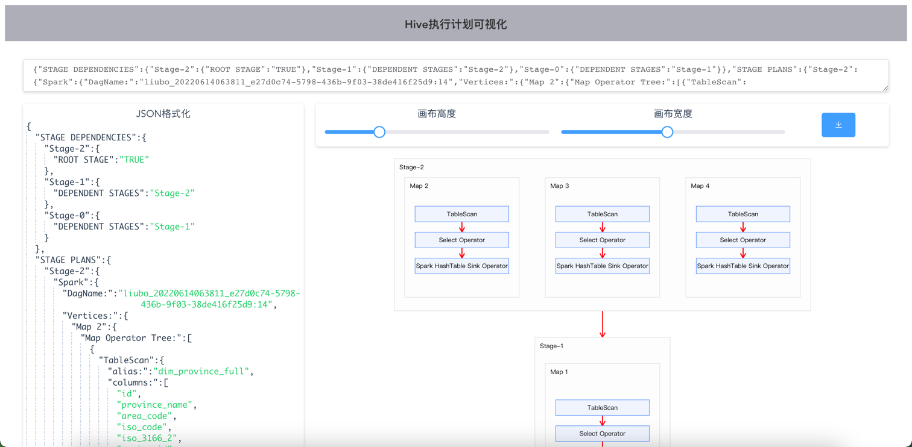

# hive-query-plan-viz

## 使用说明
使用一下命令获取格式化后的执行计划（json格式），放入输入框，即可得到执行计划图
```sql
explain formatted <sql>
```
## 效果图


## Project setup
> 我有一点小小的要求：node版本<=14

```
npm install
```

### Compiles and hot-reloads for development
```
npm run serve
```

### Compiles and minifies for production
```
npm run build
```

### Lints and fixes files
```
npm run lint
```

